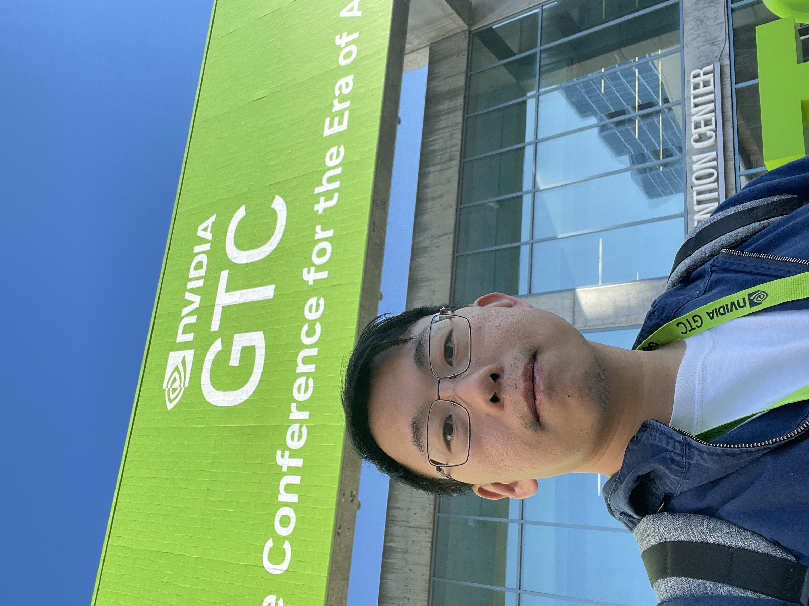

# Some Pictures from GTC 2024

I don't have the 💰 funding to support a paid infra just yet... 
So can only show pics here instead 1GB max-mem free machine (at the mercy of streamlit cloud 🙏).
Thanks for your understanding!

---
This was convention center parking at 7:30 on the 18th (Note: Speaker Keynote is 1PM)

---
👋 Welcome to GTC24!

---

I think I can safely claim that I was like roughly about 100 feet from "Taylor Swift"

---

This graph of "Throughput per GPU vs Users Traffic" was not easy to explain! Nvidia could use a better DS.

---

NIM is an interesting concept - as long as you become a customer of Nvidia 🤓

---

Jim Fan talking about Generally Capable Agents:
> I believe in a future where everything that moves will eventually be autonomous. ChatGPT unifies all kinds of natural language understanding tasks in a single interface: text in, text out. What is the equivalent for an AI agent? What does it take to build a model that actively explores the world, ingests multimodal sensory stream, plans over long horizons, acquires new skills, and bootstraps its own capabilities in a self-improving loop? I'll lay out a blueprint for the Foundation Agent, a single model that generalizes across diverse tasks, embodiments, and realities. And that will be the next grand challenge in our quest for AI. || [the summary](https://github.com/jac0320/gtcsummary/blob/main/summarized_notes/Generally%20Capable%20Agents%20in%20Open-Ended%20Worlds.md)

---

OpenAI's COO Brad Lightcap on "What's Next in Generative AI" || [the summary](https://github.com/jac0320/gtcsummary/blob/main/summarized_notes/What%E2%80%99s%20Next%20in%20Generative%20AI.md)

---

In case you need the 1001st diagram about RAG to explain to your stakeholders. This one is pretty solid.

---

Fireside Chat With Percy Liang and Jim Fan: The Future of Foundation Models 
> Percy Liang, a professor from Stanford University, has been at the forefront of large language model (LLM) research. Percy is widely recognized for introducing the term foundation models, to capture the paradigm shift defining the modern AI landscape. In this fireside chat, we'll explore many fundamental questions that will reshape the future of foundation models. What are the key limitations of our most capable foundation models? What are the most promising ideas to improve their reasoning capabilities? How do we build benchmarks that evaluate foundation models systematically and comprehensively? How do we build AI agents that make decisions autonomously? What behaviors emerge when multiple agents interact with each other in a simulation? What are the roles of the open-source community and academia in this new era of foundation models? Please join us for an informative and enlightening conversation!

---

From Model Development for Bias, Factuality, and Attribution by Vijay Karunamurthy, an Apple Alumni.

> The responsible use and development of AI requires categorizing, assessing, and mitigating enumerated risks. We'll discuss topics like red teaming, reinforcement learning from human feedback, and frameworks for responsible AI to ensure that fine-tuned models behave as intended.

---

Fireside Chat: Building Practical AI Agents that Reason and Code at Scale || [the summary](https://github.com/jac0320/gtcsummary/blob/main/summarized_notes/Fireside%20Chat%20With%20Kanjun%20Qiu%20and%20Bryan%20Catanzaro%3A%20Building%20Practical%20AI%20Agents%20that%20Reason%20and%20Code%20at%20Scale.md)

---

This robot from Boston Dynamics moves fast 💨

[![Watch the video]](https://www.youtube.com/shorts/ygx7smBj4eg)

---

Last but not least, probably the only solid proof that I was there:

